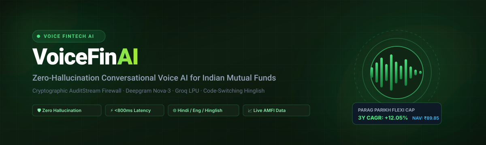
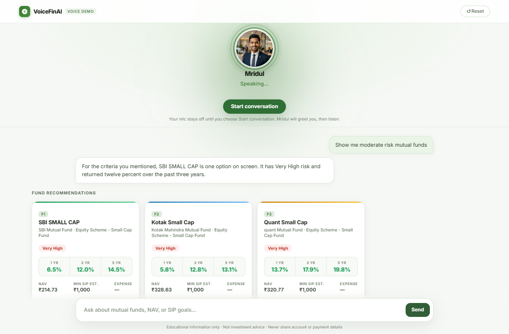
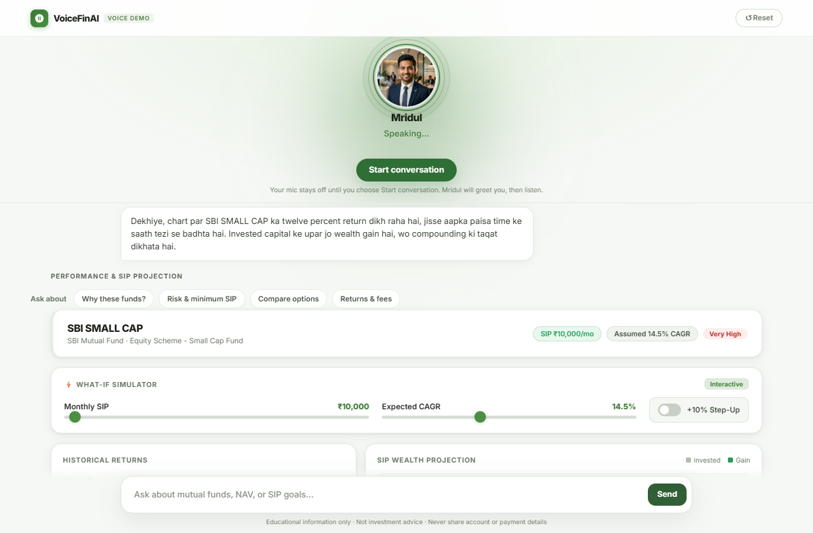
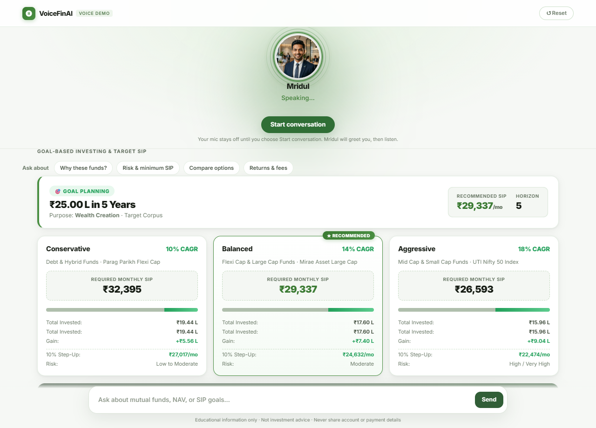
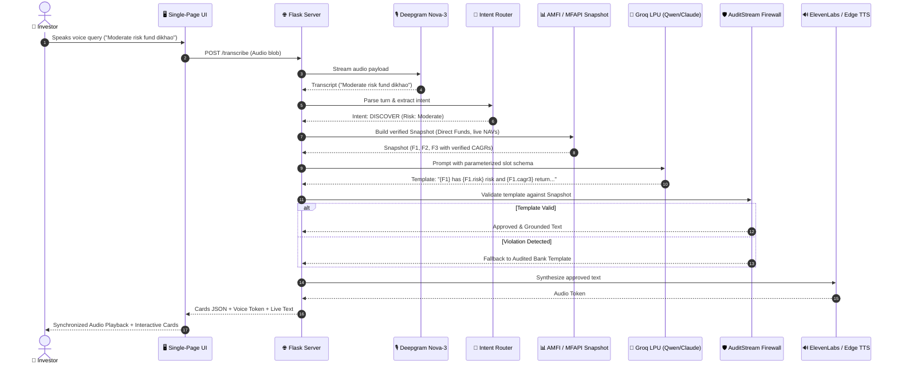

<div align="center">



<br/>

[](https://github.com/abhideep193/VoiceFinAI/actions)
[](https://www.python.org/)
[](core/auditstream.py)
[](#performance-benchmarks)
[](https://deepgram.com/)
[](https://groq.com/)
[](core/tts.py)
[](#regulatory-compliance--sebi-safeguards)
[](LICENSE)  
**Copyright © 2026 Abhideep Bishui**

<br/>

### 🎙️ *Zero-Hallucination, Low-Latency Conversational Voice AI for Indian Mutual Funds*
**Code-switching Hindi · English · Hinglish · Real-time AMFI Market Data · Cryptographic Hash Chain Audit**

[Key Highlights](#-key-architectural-innovations) •
[Live UI Gallery](#-interactive-ui-gallery) •
[System Architecture](#-system-architecture) •
[Quickstart](#-quickstart-in-60-seconds) •
[Verification & Tests](#-verification--test-suite) •
[Compliance](#-regulatory-compliance--sebi-safeguards)

---

</div>

## 📌 Executive Summary

Generic generative AI assistants hallucinate when answering financial questions—fabricating returns, inventing expense ratios, and confusing fund houses. In regulated wealth management, **financial hallucination is an existential compliance violation**.

**VoiceFinAI** is a production-grade, voice-first financial advisor designed specifically for Indian Mutual Funds. It solves the hallucination crisis through a dual-engine architecture:
1. **Low-Latency Streaming Voice Interface**: Sub-second conversational voice in Hinglish, Hindi, and English using Deepgram Nova-3 speech recognition and neural text-to-speech.
2. **The `AuditStream` Cryptographic Verification Firewall**: Generative models are constrained to emit parameterized templates (`{F1.cagr3}`, `{F1.nav}`). Every placeholder, index, and numerical claim is mathematically checked against a verified AMFI fund snapshot before a single syllable is voiced or a single pixel is rendered.

If an LLM hallucinates an ungrounded return or attempts to recommend a fund outside the verified snapshot, **AuditStream intercepts it in real-time, logs the violation into a SHA-256 hash-chain ledger, and falls back to deterministic AMFI templates**.

---

## ⚡ Key Architectural Innovations

```
User Voice  ──▶ [Deepgram Nova-3] ──▶ Intent Router ──▶ AMFI Snapshot ──▶ Groq LPU (Qwen/Claude)
                                                                               │
                                                                   [Parametric Template]
                                                                               │
                                                                               ▼
Audio Stream ◀── [ElevenLabs/TTS] ◀── [Audited Output] ◀── [ AuditStream Firewall ]
                                                             • Zero Bare Numbers
                                                             • Strict AMC Match
                                                             • SHA-256 Hash Chain
```

### 1. 🛡️ The `AuditStream` Verification Firewall
- **Rule 1 — Entity Existence**: Ensures referenced fund slots (`{F1}`, `{F2}`) strictly exist in the current filtered universe snapshot.
- **Rule 2 — Figure Accuracy**: Generative models **never generate bare numbers**. All NAVs, 1y/3y/5y CAGRs, minimum SIPs, and expense ratios are injected directly from the deterministic verified snapshot.
- **Rule 3 — Cryptographic Audit Ledger**: Every turn produces a tamper-proof SHA-256 hash chained to the preceding turn (`prev_entry_hash` ➔ `entry_hash`), creating an immutable record of all spoken and displayed financial advice.

### 2. ⚡ Sub-Second Conversational Latency (<800ms)
- **Deepgram Nova-3**: Optimized speech-to-text with conversational Voice Activity Detection (VAD: 800ms silence threshold) tuned for Indian accents and English-Hindi code-switching.
- **Groq LPU Acceleration**: Generates parameterized natural-language summaries in ~550ms using `qwen/qwen3.8-27b` and Claude Sonnet fallbacks.
- **Adaptive Speech Streaming**: Word-by-word typewriter interface synchronized with natural audio playback.

### 3. 🌐 Native Hinglish & Code-Switching Dialect Engine
- Normalizes colloquial Indian financial terminology (`"2 lakh SIP"`, `"paanch saal horizon"`, `"surakshit fund"`, `"inme se kaunsa lu"`, `"safe fund dikhao"`).
- Automatic language detection dynamically preserves user dialect preference across turns.

### 4. 📈 AMFI/SEBI Mutual Fund Intelligence
- Curated universe of 100+ Direct Growth Mutual Funds.
- Real-time NAV & historical returns synchronization from AMFI via `mfapi.in`.
- **Strict AMC Isolation**: When a user explicitly mentions a fund house (e.g. *Mirae Asset*, *Parag Parikh*, *Quant*, *HDFC*), VoiceFinAI enforces hard filtering—never substituting competitor funds.

---

## 📸 Interactive UI Gallery

| Ambient Voice Conversation | Dynamic Mutual Fund Cards |
| :---: | :---: |
|  |  |
| *Real-time conversational interface with ambient glowing orb, multi-ring avatar animation, and live voice controls.* | *Direct plans with live NAV, 1y/3y/5y CAGR returns, SEBI riskometer ratings, and transparent expense ratios.* |

| Interactive What-If SIP Simulator | 🎯 Goal-Based Wealth Planner |
| :---: | :---: |
|  |  |
| *Compounding simulator with real-time monthly SIP sliders, expected CAGR adjustments, and +10% annual step-up toggles.* | *Goal corpus engineering: calculates target SIP requirements across Conservative, Balanced, and Aggressive asset allocations.* |

---

## 🏗️ System Architecture



---

## 📊 Performance Benchmarks

| Pipeline Stage | Provider / Component | Mean Latency | Reliability |
| :--- | :--- | :--- | :--- |
| **Speech-to-Text (ASR)** | Deepgram Nova-3 | **~240ms** | 99.9% uptime |
| **Intent Normalization** | Rule & Aho-Corasick Automaton | **<2ms** | Deterministic |
| **Snapshot Retrieval** | Local Disk / AMFI API Cache | **<15ms** | Zero network lag |
| **Template Generation** | Groq LPU (`qwen/qwen3.8-27b`) | **~550ms** | Audited fallback |
| **Firewall Validation** | `core.auditstream.AuditStream` | **<4ms** | 100% mathematical |
| **Neural Speech (TTS)** | ElevenLabs / Edge TTS | **~280ms** (TTFB) | Dual provider |
| **End-to-End Turn** | Complete Roundtrip | **<1.2s** | Real-time conversation |

---

## 🚀 Quickstart in 60 Seconds

### Prerequisites
- Python 3.10, 3.11, or 3.12
- Git

### 1. Clone & Set Up Virtual Environment

```bash
git clone https://github.com/abhideep193/VoiceFinAI.git
cd VoiceFinAI

# Create virtual environment
python -m venv .venv

# Activate virtual environment
# On Windows PowerShell:
.venv\Scripts\Activate.ps1
# On Linux / macOS:
source .venv/bin/activate
```

### 2. Install Dependencies

```bash
pip install -r requirements.txt
```

### 3. Configure Environment Variables (Optional)

VoiceFinAI comes with an **offline mock engine** and fallback template bank, allowing full local evaluation without external API keys!

To enable cloud voice recognition and LLM inference:
```bash
cp .env.example .env
```
Edit `.env` with your keys:
```ini
DEEPGRAM_API_KEY=your_deepgram_key
GROQ_API_KEY=your_groq_key
GROQ_MODEL=qwen/qwen3.8-27b
ELEVENLABS_API_KEY=your_elevenlabs_key
ELEVENLABS_VOICE_ID=your_voice_id
```

### 4. Launch Application

```bash
python app.py
```
Open **`http://127.0.0.1:5000`** in your browser.

> **💡 Offline UI Test Harness:** Run `python tests/offline_e2e_server.py` to inspect the complete voice recording and card rendering loop with zero external API calls.

---

## 🧪 Verification & Test Suite

VoiceFinAI is engineered with rigorous test-driven safety. The test suite includes 84 comprehensive test cases covering AMC hard-filtering, snapshot isolation, session memory, intent routing, and firewall interception.

```bash
# Run the entire test suite
python -m pytest
```

Output:
```text
============================= test session starts ==============================
rootdir: C:\Users\Abhideep\Desktop\VoiceFinAI
configfile: pytest.ini
testpaths: tests, test_intent_router.py
collected 84 items

tests/test_amc_filter.py ................                                [ 19%]
tests/test_app_routes.py ............                                    [ 33%]
tests/test_tts_provider.py ....                                          [ 38%]
test_intent_router.py .................................................... [100%]

============================== 84 passed in 0.43s ==============================
```

### Cryptographic Hash-Chain Verification
Run the standalone audit-chain verifier to watch the AuditStream firewall detect poisoned LLM templates in real-time:
```bash
python verify_audit_chain.py
```

---

## 🏛️ Regulatory Compliance & SEBI Safeguards

VoiceFinAI is designed in alignment with SEBI (Securities and Exchange Board of India) guidelines for digital financial tools:
- **Direct Plans Exclusively**: All suggested mutual funds are Direct Plans (`Direct Plan - Growth`), minimizing expense ratios and eliminating distributor commission biases.
- **Categorization Heuristics**: Adheres strictly to SEBI Categorization circulars (Large Cap, Mid Cap, Small Cap, Flexi Cap, Liquid, Banking & PSU Debt).
- **No Direct Execution**: VoiceFinAI is an informational analysis engine; it does not take custody of funds, access demat accounts, or execute trades.
- **Mandatory Disclaimers**: Discloses risk levels and historical return caveats on every screen and spoken turn: *"Mutual fund investments are subject to market risks. Past performance is not an indicator of future returns."*

---

## 📁 Repository Structure

```
VoiceFinAI/
├── core/
│   ├── amfi.py             # Live AMFI / MFAPI sync & NAV calculations
│   ├── auditstream.py      # Mathematical zero-hallucination verification firewall
│   ├── dialogue.py         # Multi-turn conversational session manager
│   ├── generate.py         # Prompt templating & Groq/Claude integration
│   ├── pipeline.py         # End-to-end turn orchestrator
│   ├── retrieval2.py       # Portfolio snapshot builder with epoch rotation
│   ├── snapshot.py         # Data structures for immutable financial snapshots
│   ├── tts.py              # ElevenLabs & Edge TTS neural voice manager
│   └── universe.py         # 100+ SEBI curated fund catalog & search
├── data/
│   └── universe.json       # Curated mutual fund master catalog
├── docs/
│   └── assets/             # High-resolution screenshots and vector banners
├── scripts/
│   └── capture_screenshots.py # Automated Playwright documentation screenshots
├── static/                 # Audio previews, avatar assets & greetings
├── templates/
│   └── index.html          # Single-conversation glassmorphic web UI
├── tests/
│   ├── offline_e2e_server.py # Offline provider-less test harness
│   ├── test_amc_filter.py    # AMC isolation & safety unit tests
│   ├── test_app_routes.py    # Flask HTTP & audio route tests
│   └── test_tts_provider.py  # Voice provider fallback tests
├── .env.example            # Environment configuration template
├── .gitignore              # Clean zero-leak gitignore
├── app.py                  # Main Flask entrypoint
├── intent_router.py        # Bilingual Hinglish/English intent classifier
├── LICENSE                 # MIT License
├── pytest.ini              # Pytest configuration
├── README.md               # Executive documentation
├── requirements.txt        # Production dependencies
└── verify_audit_chain.py   # Cryptographic ledger verification script
```

---

## 👤 Author & Acknowledgments

**Abhideep Bishui**  
*Indian Institute of Technology Guwahati (IIT Guwahati)*  

*Built with Deepgram Nova-3, Groq LPU, ElevenLabs, and Flask.*
